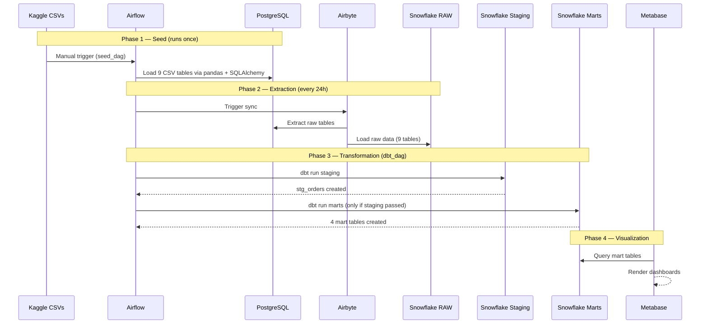

# Olist Data Platform: ELT Data Pipeline with Airflow, Airbyte, dbt, and Snowflake


**Status: Phase 1 complete — pipeline operational. Phase 2 in progress — analysis layer (7/29 analyses complete).**

---

## Table of Contents

- [The Problem This Project Solves](#the-problem-this-project-solves)
- [Architecture Overview](#architecture-overview)
- [Tech Stack](#tech-stack)
- [Dataset](#dataset)
- [Project Structure](#project-structure)
- [How to Run This Project](#how-to-run-this-project)
  - [Step 1: Clone and configure](#step-1-clone-the-repository-and-configure-your-environment)
  - [Step 2: Start the stack](#step-2-start-the-stack)
  - [Step 3: Seed PostgreSQL](#step-3-seed-postgresql-with-olist-data)
  - [Step 4: Configure Airbyte](#step-4-install-and-configure-airbyte)
  - [Step 5: Prepare Snowflake](#step-5-prepare-snowflake)
  - [Step 6: Run dbt transformations](#step-6-run-dbt-transformations)
  - [Step 7: Connect Metabase](#step-7-connect-metabase-to-snowflake)
- [Phase 2 — Analysis Layer](#phase-2--analysis-layer)
- [Snowflake Cost Tracking](#snowflake-cost-tracking)
- [Mart Models: What Gets Built](#mart-models-what-gets-built)
- [Scalability: Where This Goes Next](#scalability-where-this-goes-next)
- [Key Concepts Reference](#key-concepts-reference)
- [Known Issues and Solutions](#known-issues-and-solutions)
- [Glossary](#glossary)
- [Author](#author)

This is a portfolio project by a data analyst building the engineering foundation for her own analytical work.
It implements a modern ELT data pipeline using open-source tools and a cloud data warehouse, simulating a real-world migration from a legacy SQL environment to a scalable, cloud-native architecture.

**Stack:** Python · SQL · Apache Airflow · Airbyte · dbt · Snowflake · PostgreSQL · Docker · Metabase

**Skills demonstrated:** data pipeline orchestration · ELT architecture · data warehouse modeling · SQL transformations with dbt · workflow automation with Airflow · cloud data ingestion with Airbyte · containerized environments with Docker

---

## The Problem This Project Solves

### What legacy data environments actually look like

This project was not built from a textbook. It was built from patterns observed across financial institutions, healthcare consultancies, and retail operations. These patterns repeat regardless of industry.

---

#### Scenario A: The Single Point of Failure

> In a healthcare consultancy, all reporting ran through a single legacy SQL system. Queries were so resource-intensive that the team could not run them simultaneously. Engineers would take turns. On busy days, people simply waited or made decisions without data.
>
> The vendor claimed the system had "partial parallelism." In practice, it meant: one person runs a heavy query, everyone else stares at a loading screen.

This is the **monolithic architecture problem**: storage and compute live on the same server. Everyone shares the same resources. Scale does not exist.

---

#### Scenario B: The Spreadsheet Archipelago

> At a financial institution, each analyst maintained their own version of the truth: a VBA macro spreadsheet saved on their local machine. Sharing data meant sending files by email. Versioning meant renaming files `report_final_v3_REAL_THIS_ONE.xlsx`.
>
> The person who originally built the system had left two years prior. No documentation. No handover. Complex queries that nobody fully understood anymore. When a client had errors across 6 tables, the team counted it as 6 separate problems and manually corrected each one.

This is the **knowledge silo problem** combined with no single source of truth.

---

#### Scenario C: Inconsistent Numbers in the Room

> In meetings, the finance team presented one number and the operations team presented another. Both were technically correct — they came from different systems, with different filters, at different times. Nobody knew which one to trust.

This is the **data consistency problem**: no unified pipeline means no unified answer.

---

### What all three scenarios have in common

| Problem | Root Cause |
|---|---|
| System freezes under load | Storage and compute are coupled |
| Knowledge lives in one person | No documentation, no versioning |
| Numbers don't match between teams | No single source of truth |
| Manual corrections are the norm | No data quality layer |
| Spreadsheets emailed between people | No centralized data layer |

This project builds the infrastructure that solves all five.

---

## Architecture Overview



---

### Pattern: ELT, not ETL

| | ETL (legacy) | ELT (this project) |
|---|---|---|
| When to transform | Before loading | After loading |
| Where to transform | Application layer | Inside the warehouse |
| Scalability | Limited by the ETL server | Scales with Snowflake |
| Auditability | Harder | Full raw data always available |

---

## Tech Stack

| Tool | Role | Why this, not something else |
|---|---|---|
| PostgreSQL 16 | Legacy server simulation | Industry-standard relational DB; mirrors real on-premise environments |
| Apache Airflow 2.11.2 | Orchestration | De facto standard for pipeline scheduling; DAG-based dependency control |
| Airbyte 2.0.1 | Data extraction and loading | 300+ native connectors; no-code EL layer; avoids overloading the source system |
| Snowflake | Cloud data warehouse | Separates storage from compute, which is the core architectural advantage |
| dbt 1.11.7 | Transformation layer | SQL-based, version-controlled, testable transformations |
| Metabase | BI and dashboards | Open-source; connects directly to Snowflake; no-code for business users |
| Docker | Local environment | Reproducibility; mirrors production containers |

### Why Snowflake over Redshift or Synapse

| | Snowflake | Redshift | Synapse |
|---|---|---|---|
| Cloud lock-in | None (multi-cloud) | AWS only | Azure only |
| Storage/compute separation | Fully separated | Partial | Partial |
| Multiple concurrent warehouses | Native | Requires config | Requires config |
| Best for | Multi-cloud / no lock-in | Full AWS stack | Full Azure stack |

> The single most important reason: in Snowflake, 20 analysts can query simultaneously without competing for resources. Each team can have its own virtual warehouse. No more waiting in line.

---

## Dataset

**Source:** [Brazilian E-Commerce Public Dataset by Olist](https://www.kaggle.com/datasets/olistbr/brazilian-ecommerce) via Kaggle  
**Volume:** 99,441 orders across 9 tables  
**Period:** 2016 to 2018

| Table | Primary Key |
|---|---|
| olist_orders_dataset | order_id |
| olist_customers_dataset | customer_id |
| olist_order_items_dataset | order_id + order_item_id |
| olist_order_payments_dataset | order_id + payment_sequential |
| olist_order_reviews_dataset | review_id |
| olist_sellers_dataset | seller_id |
| olist_products_dataset | product_id |
| olist_geolocation_dataset | geolocation_zip_code_prefix |
| product_category_name_translation | product_category_name |

---

## Project Structure

```
olist-data-platform/
├── .env                         <- Real credentials (NEVER pushed to GitHub)
├── .env.example                 <- Template without values (safe to push)
├── .gitignore
├── docker-compose.yml           <- Defines all containers
├── dags/
│   ├── seed_dag.py              <- Loads CSVs into PostgreSQL (runs once)
│   └── dbt_dag.py               <- Runs dbt staging then marts (with dependency)
├── data/                        <- 9 Olist CSVs (gitignored)
├── dbt/
│   └── olist/
│       ├── profiles.yml         <- Real connection config (gitignored — local only)
│       ├── profiles.yml.example <- Structure reference with placeholders (safe to push)
│       ├── dbt_project.yml
│       └── models/
│           ├── staging/
│           │   ├── sources.yml
│           │   └── stg_orders.sql
│           └── marts/
│               ├── mart_sazonalidade.sql
│               ├── mart_clientes_top.sql
│               ├── mart_horarios_pico.sql
│               └── mart_perfil_cliente.sql
├── logs/                        <- Gitignored
└── plugins/
```

The `profiles.yml` connects dbt to Snowflake. Its structure:

```yaml
olist:
  outputs:
    dev:
      type: snowflake
      account: YOUR_ACCOUNT_HERE
      user: YOUR_USER_HERE
      password: YOUR_PASSWORD_HERE
      role: ACCOUNTADMIN
      database: OLIST_DB
      schema: RAW
      warehouse: COMPUTE_WH
      threads: 4
  target: dev
```

Copy `profiles.yml.example` to `profiles.yml` and fill in your credentials before running dbt.

---

## How to Run This Project

### Prerequisites

- Docker Desktop installed and running
- A free [Snowflake trial account](https://signup.snowflake.com/)
- Airbyte installed via `abctl` (see Step 4)

---

### Step 1: Clone the repository and configure your environment

```bash
git clone https://github.com/srxkatsumi/olist-data-platform.git
cd olist-data-platform
```

The `.env` file is gitignored and will not exist after cloning. Create your own copy from the template:

```bash
cp .env.example .env
```

Open `.env` and fill in your credentials:

```
AIRFLOW_UID=50000

# Snowflake
SNOWFLAKE_ACCOUNT=your_account_here
SNOWFLAKE_USER=your_user_here
SNOWFLAKE_PASSWORD=your_password_here
SNOWFLAKE_DATABASE=OLIST_DB
SNOWFLAKE_WAREHOUSE=COMPUTE_WH
SNOWFLAKE_SCHEMA=RAW
SNOWFLAKE_ROLE=ACCOUNTADMIN

# Airbyte
AIRBYTE_PASSWORD=your_airbyte_password_here
```

> Your Snowflake account identifier is found in your console URL: `https://YOUR_ACCOUNT.snowflakecomputing.com`

> Never commit your `.env` file. It is already listed in `.gitignore`, but always double-check before pushing.

---

### Step 2: Start the stack

```bash
# First time only: initialize the Airflow database
docker compose up airflow-init

# Start all containers
docker compose up -d

# Verify everything is healthy
docker compose ps
```

Access Airflow at: `http://localhost:8080` (user: `airflow` / pass: `airflow`)  
Access Metabase at: `http://localhost:3000`

---

### Step 3: Seed PostgreSQL with Olist data

Download the 9 CSV files from [Kaggle](https://www.kaggle.com/datasets/olistbr/brazilian-ecommerce) and place them inside the `data/` folder.

Then in the Airflow UI:
1. Go to **DAGs** and find `seed_dag`
2. Toggle it ON
3. Click **Trigger DAG**
4. Wait for all tasks to turn green

This runs once only. It loads the CSVs into PostgreSQL, simulating data that already exists on a legacy server.

---

### Step 4: Install and configure Airbyte

```bash
# Install abctl (Airbyte's Kubernetes-based local installer)
curl -LsfS https://get.airbyte.com | bash
abctl local install

# Retrieve your login credentials
abctl local credentials
```

Access Airbyte at: `http://localhost:8000`

**Create a Source (PostgreSQL):**
- Host: your local machine's network IP (not `localhost`, because Airbyte runs in Kubernetes and cannot reach the Docker network directly)
- Port: `5432`
- Database: `airflow`
- Username: `airflow`

> On Mac, find your local IP in System Settings > Network. Use that IP address instead of `localhost` or `host.docker.internal`.

**Create a Destination (Snowflake):**
- Fill in your account, user, password, and warehouse
- Database: `OLIST_DB`
- Schema: `RAW`

**Create a Connection:**
- Schedule: Every 24 hours
- Namespace: Custom > `RAW`
- Select all 9 Olist tables and exclude Airflow internal tables such as `dag`, `task_instance`, and `log`

---

### Step 5: Prepare Snowflake

In your Snowflake console, run:

```sql
CREATE DATABASE OLIST_DB;
CREATE SCHEMA OLIST_DB.RAW;
```

Then trigger a manual sync in Airbyte and verify the 9 tables appear inside `OLIST_DB.RAW`.

---

### Step 6: Run dbt transformations

```bash
cp dbt/olist/profiles.yml.example dbt/olist/profiles.yml
# Fill in your credentials in profiles.yml
```

In the Airflow UI:
1. Go to **DAGs** and find `dbt_dag`
2. Toggle it ON
3. Click **Trigger DAG**

Two tasks will run in sequence:
- `dbt_staging` creates `stg_orders` as a view in Snowflake
- `dbt_marts` creates the 4 mart tables and only runs if staging passed successfully

---

### Step 7: Connect Metabase to Snowflake

Before opening Metabase for the first time, create its metadata database:

```bash
docker exec -it olist-postgres-1 psql -U airflow -c "CREATE DATABASE metabase;"
docker compose restart metabase
```

Then at `http://localhost:3000`:
1. Add a database and select Snowflake
2. Connect to `OLIST_DB` using the `RAW` schema
3. Build dashboards from the mart tables

---

## Phase 2 — Analysis Layer

Phase 2 implements 29 business analyses as dbt SQL files under `dbt/olist/analyses/`. Each analysis compiles via `dbt compile` and runs directly on Snowflake without creating persistent objects. Analyses that prove valuable will be promoted to mart models in Phase 3.

**Overall Phase 2 progress**
████░░░░░░░░░░░░░░░░ 24% (7/29 analyses)

| Group | Progress | Status |
|---|---|---|
| Group 1 — Sales & Revenue | `███████████████████ 100%` (7/7) | ✅ complete |
| Group 2 — Customers | `░░░░░░░░░░░░░░░░░░░ 0%` (0/5) | 🔄 next |
| Group 3 — Deliveries & Operations | `░░░░░░░░░░░░░░░░░░░ 0%` (0/5) | ⏳ pending |
| Group 4 — Sellers | `░░░░░░░░░░░░░░░░░░░ 0%` (0/4) | ⏳ pending |
| Group 5 — Reviews & Satisfaction | `░░░░░░░░░░░░░░░░░░░ 0%` (0/4) | ⏳ pending |
| Group 6 — Seasonality & Hours | `░░░░░░░░░░░░░░░░░░░ 0%` (0/4) | ⏳ pending |

---

## Snowflake Cost Tracking

This table documents the real cloud cost of running the pipeline as the project grows across phases. It is updated manually as each analysis group is completed.

| Date | Milestone | Compute spend (USD) | Credits used |
|---|---|---|---|
| 2026-04-16 | Phase 1 complete + Phase 2 Group 1 (7 analyses, 9 source tables loaded) | $12.48 | 3.64 |

> Cost baseline: $3.90 per credit · Average daily cost: $0.03

---

## Mart Models: What Gets Built

| Model | Business Question |
|---|---|
| `mart_sazonalidade` | What are the seasonality patterns of sales by month? |
| `mart_clientes_top` | Which customers have the highest lifetime value? |
| `mart_horarios_pico` | At what hours and days do most orders happen? |
| `mart_perfil_cliente` | What is the geographic and behavioral profile of the customer base? |

### Analyses (Phase 2)

| File | Description |
|---|---|
| `01_top_categories_by_revenue.sql` | Top 10 product categories by revenue and order volume |
| `02_monthly_revenue_trend.sql` | Monthly and yearly revenue trend with month-over-month difference |
| `03_cancellation_rate_by_category.sql` | Cancellation rate per category, filtered to categories with 100+ orders |
| `04_avg_ticket_by_category.sql` | Average, min and max item price per category |
| `05_pareto_revenue_by_category.sql` | Pareto analysis showing which categories concentrate 80% of revenue |
| `06_payment_method_by_state.sql` | Preferred payment methods broken down by Brazilian state |
| `07_installments_by_category.sql` | Average number of credit card installments per product category |

---

## Scalability: Where This Goes Next

This project is a Phase 1 foundation. Here is what a production-grade version looks like.

### Phase 2: Robustness

| Addition | Purpose |
|---|---|
| Airflow triggers Airbyte via API | Remove the manual step; Airbyte syncs only after Airflow confirms it is time |
| dbt tests (`not_null`, `unique`, `accepted_values`) | Catch bad data before it reaches dashboards |
| Dead Letter Queue (ERR schema in dbt) | Isolate records that fail validation instead of silently dropping them |
| Alerting on DAG failure | Slack or email notification when a pipeline breaks |

### Phase 3: Scale

| Addition | Purpose |
|---|---|
| Replace local PostgreSQL with AWS RDS | Remove the network workaround; RDS lives in the same VPC as Snowflake |
| Replace local Airflow with AWS MWAA | Managed, scalable orchestration with no infrastructure overhead |
| Separate Snowflake schemas (STAGING, MARTS) | Currently both layers share the RAW schema — Phase 3 introduces proper layer isolation |
| SCD Type 2 (HST schema in dbt) | Track historical changes in slowly-changing dimensions such as customer address |
| Incremental dbt models | Only process new or changed records instead of full refresh |
| Multiple Snowflake warehouses | Separate compute for analytics, pipelines, and dbt with no resource contention |

### Phase 4: Platform

| Addition | Purpose |
|---|---|
| Data catalog (e.g., DataHub) | Anyone on the team can discover what data exists and what it means |
| Column-level lineage | Trace exactly which source column feeds which dashboard metric |
| Event-driven pipelines | Trigger processing when new data arrives, not on a fixed schedule |
| CI/CD for dbt models | Tests run automatically on every pull request before merging to production |

---

## Key Concepts Reference

### Who executes vs. who stores

| Step | Executor | Storage |
|---|---|---|
| Read CSVs | pandas | RAM (temporary) |
| Insert into PostgreSQL | SQLAlchemy | PostgreSQL |
| Extract from PostgreSQL | Airbyte | — |
| Load to Snowflake RAW | Airbyte | Snowflake |
| Transform: staging | dbt (SQL runs inside Snowflake) | Snowflake |
| Transform: marts | dbt (SQL runs inside Snowflake) | Snowflake |
| Schedule everything | Airflow | — |
| Visualize | Metabase | — |

> Rule: Airflow does not run data code. It does not store data. It only schedules and triggers other tools.

### Snowflake's 3-layer architecture

```
Cloud Services  -> Authentication, query optimization, metadata
      |
Compute Layer   -> Virtual Warehouses (COMPUTE_WH)
                   Scale up/down independently
                   Multiple warehouses run in parallel
      |
Storage Layer   -> Columnar format on AWS S3
                   Persists independently of compute
                   Micro-partitions of approximately 16MB each
```

---

## Known Issues and Solutions

| Issue | Cause | Solution |
|---|---|---|
| Airbyte can't connect to PostgreSQL | Kubernetes network is separate from Docker network | Use the machine's local IP instead of `localhost` |
| `database "metabase" does not exist` | Metabase DB not created before first startup | Run `CREATE DATABASE metabase;` then restart the container |
| pandas version conflict with Airflow | Provider requires `pandas < 2.2` | Pin to `pandas==2.1.4` in docker-compose |
| Snowflake account locked | Wrong password caused multiple failed login attempts | Fix `.env` then unlock the user in Snowflake Admin UI |
| `profiles.yml` not found in Airflow | File was created under a different user path | Pass `--profiles-dir /opt/airflow/dbt/olist` in every dbt command |

---

## Glossary

| Term | Meaning |
|---|---|
| ELT | Extract, Load (raw), Transform (inside the warehouse) |
| DAG | Directed Acyclic Graph: a pipeline with ordered, non-circular tasks |
| dbt | Data Build Tool: SQL-based transformation with version control |
| SCD Type 2 | Slowly Changing Dimension: tracks historical changes in a record |
| CDC | Change Data Capture: captures only changed rows since the last sync |
| Virtual Warehouse | Snowflake's isolated compute unit that scales independently from storage |
| Mart | A business-facing aggregated table built for a specific analytical question |
| Staging | An intermediate layer that cleans and casts raw data before marts |

---

## Author

**Vicky Costa**  
Data Analyst | Data Science student (since February 2025)  
Background in e-commerce, banking, and healthcare consulting.  
Built this data engineering foundation to support my own analytical work — and to solve the infrastructure problems I lived through as an analyst.

[LinkedIn](https://www.linkedin.com/in/vickycosta/) · [GitHub](https://github.com/srxkatsumi)

